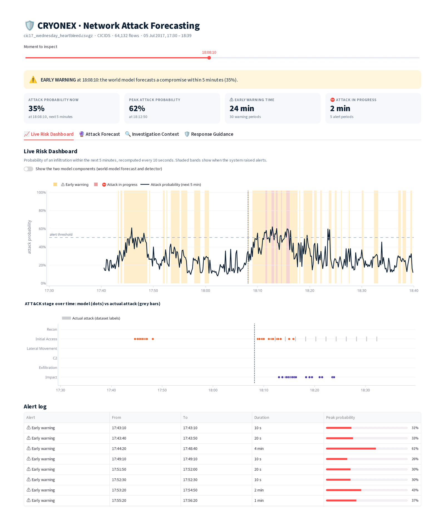
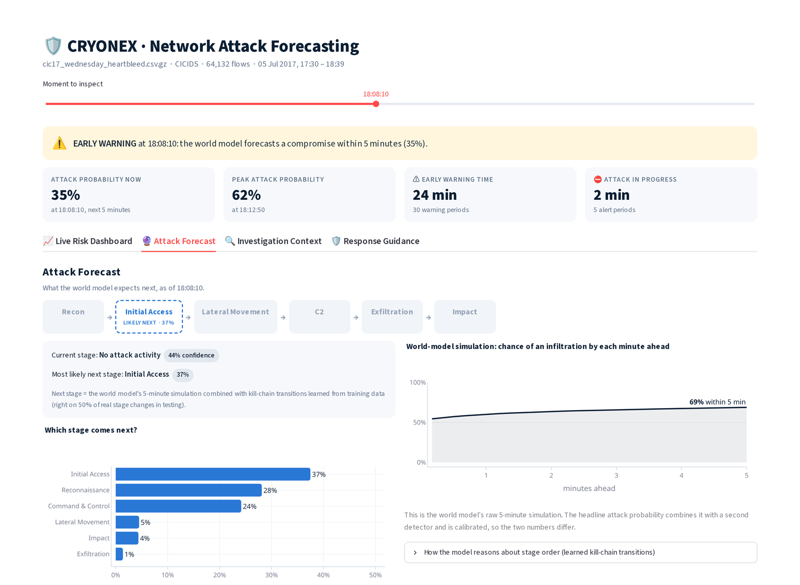
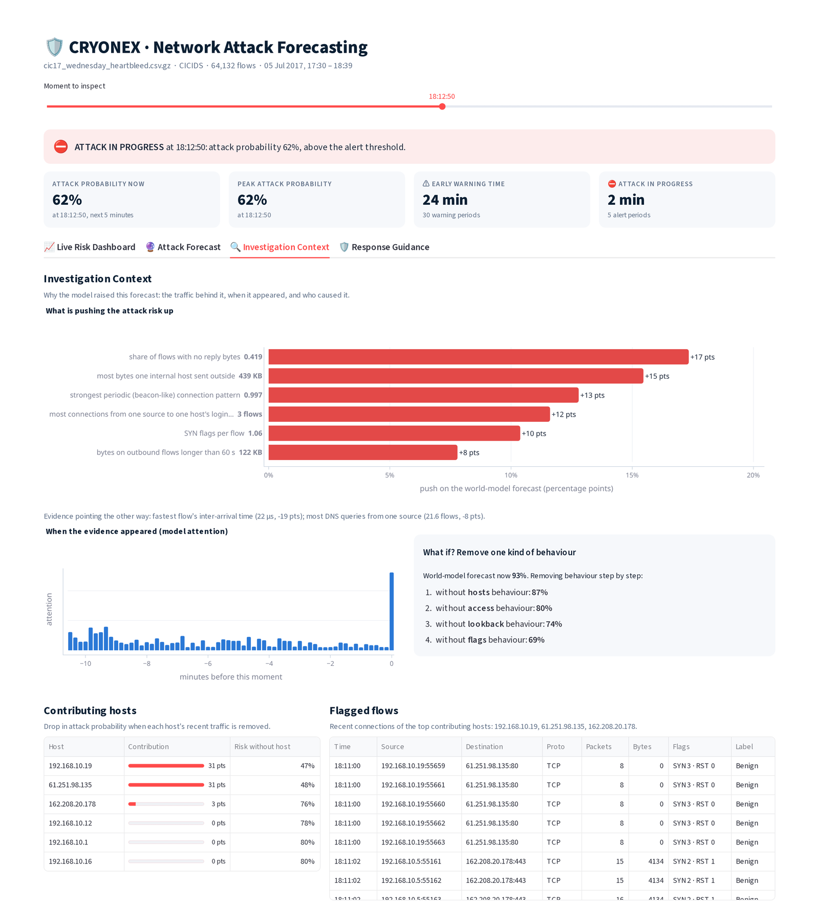
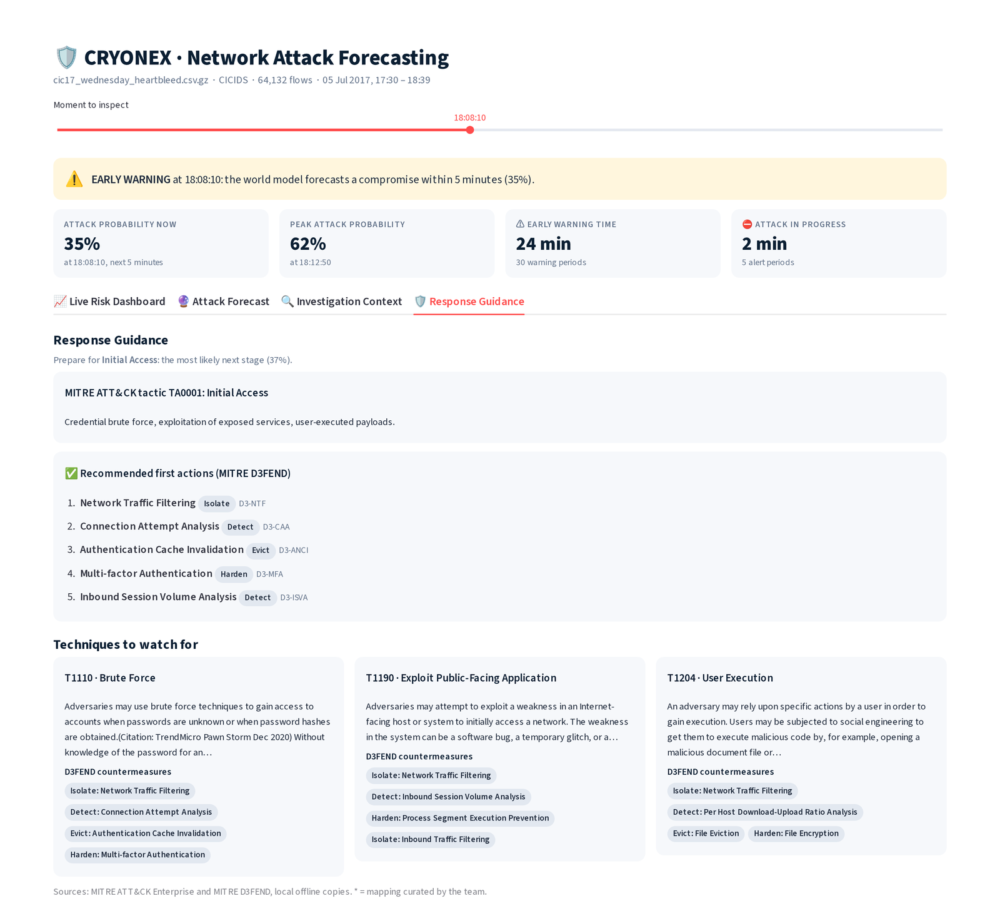

# CRYONEX: forecasting network attacks before they complete

**Smart India Hackathon 2026 · Problem Statement SIH26153 (NTRO): "AI based Network Attack Forecasting from Network Traffic Data" · Team CRYOBLUE**

CRYONEX is a **world model** for network security. It learns how a network's state evolves over
time, `P(S_t+1 | S_t)`, from flow-level and packet-level traffic, **simulates the next 5 minutes**,
and warns defenders **before** an attack completes, naming the MITRE ATT&CK stage, the traffic
that caused the warning, and the D3FEND response. It runs **fully offline on an ordinary CPU laptop**.



*Real, held-out traffic (CIC-IDS2017 Heartbleed). The model had never seen a Heartbleed attack.
Early warning at 18:08, attack confirmed at 18:11, the real exploit starts at 18:12.*

---

## Contents

1. [What it does](#1-what-it-does)
2. [Problem statement coverage](#2-problem-statement-coverage)
3. [Results](#3-results)
4. [Setup (about 10 minutes)](#4-setup-about-10-minutes)
5. [Dashboard tour](#5-dashboard-tour)
6. [Command-line use](#6-command-line-use)
7. [Reproducing training and every result](#7-reproducing-training-and-every-result)
8. [How it works](#8-how-it-works)
9. [Repository layout](#9-repository-layout)
10. [Honest limits](#10-honest-limits)
11. [Deliverables, licence and team](#11-deliverables-licence-and-team)

---

## 1. What it does

For every 10 seconds of traffic, CRYONEX reports:

| Output | Meaning |
|---|---|
| **Attack probability** | chance of an infiltration within the next 5 minutes, from a 30-step forward simulation |
| **Two alert levels** | ⚠️ *Early warning*: an attack is forecast, before anything is visible. ⛔ *Attack in progress*: confirmed by the combined score |
| **ATT&CK stage** | the stage the network is in now (Reconnaissance, Initial Access, Lateral Movement, Command & Control, Exfiltration, Impact) and the most likely **next** stage |
| **Why** | the traffic features pushing the risk up (in real units), when the evidence appeared, and a what-if |
| **Who** | the hosts responsible (found by re-simulating without each one) and their flagged flows |
| **What to do** | MITRE ATT&CK techniques and D3FEND countermeasures, from a local offline copy |

## 2. Problem statement coverage

| PS requirement | Where it is in CRYONEX |
|---|---|
| Flow-level features: IP/port pairs, TCP flags, protocol, bytes, packets, duration, IAT stats, bidirectional ratios | `kcwm/features` (92 features per 10-s window, 12 groups) |
| Packet-level features: TTL and variance, TCP window, fragments, payload sizes, port-scan signatures, retransmissions | `kcwm/ingest/pcap.py` (NFStream + our raw IP-header decoder), `kcwm/features` |
| Ingest CIC-IDS2018 / CTU-13 CSV and raw PCAP → timestamped, normalised feature matrix | `cryonex build`, `cryonex forecast`, the dashboard upload |
| Network state as a feature vector | 92 features + 3 "was it measured" masks per window |
| Learn `P(S_t+1 \| S_t)` with a sequence model, not a static classifier | causal Transformer world model with explicit ATT&CK stage dynamics and a next-state decoder (`kcwm/model`) |
| Supervised dynamics learning on labelled open datasets | trained on the attack timelines of 4 public datasets (~60 million flows) |
| Generalise to unseen attack patterns | tested by hiding whole attack families from training: **0.782 vs 0.569** for the baseline, 7 of 7 families |
| K-step forward simulation → infiltration probability time series | exact rollout over (stage, progress), 30 steps (`kcwm/model/rollout.py`) |
| Predicted MITRE ATT&CK stage | current stage + next stage (`kcwm/inference/engine.py`) |
| Driving features via attention / attribution | integrated gradients + attention + counterfactuals, faithfulness-tested (`kcwm/explain`) |
| Offline demo interface: PCAP/CSV in → probability timeline, flagged flows, stage annotations | Streamlit dashboard (`cryonex serve`); no cloud or internet calls |
| Training scripts, weights, reproducible config | `scripts/run_final.sh`, `artifacts/release/`, `configs/default.yaml` |
| Benchmark vs logistic regression (F1, precision, recall, FPR) | [`docs/BENCHMARKS.md`](docs/BENCHMARKS.md), generated from `results/` |

## 3. Results

Held-out test data from 4 public datasets, mean of 3 training seeds. Every number is generated
from `results/`; the full tables are in [`docs/BENCHMARKS.md`](docs/BENCHMARKS.md).

| Model (same features, same split) | AUPRC | Precision | Recall | F1 | False-positive rate |
|---|---|---|---|---|---|
| Logistic regression (**required baseline**) | 0.650 | 0.832 | 0.363 | 0.505 | 3.6% |
| Gradient boosting | 0.767 | 0.786 | 0.529 | 0.632 | 7.0% |
| LSTM classifier | 0.769 | 0.818 | 0.441 | 0.572 | 4.8% |
| CRYONEX world model alone | 0.820 | 0.861 | 0.614 | 0.711 | 5.2% |
| **CRYONEX hybrid (deployed)** | **0.847** | **0.894** | **0.620** | **0.725** | 4.2% |

| Beyond detection | Result |
|---|---|
| Real attacks warned **before they started** | **69 of 207**, median 5 minutes ahead (logistic regression: none) |
| Next ATT&CK stage predicted correctly at real stage changes | **50%** (the simulation alone: 29%) |
| Attack families never seen in training | **0.782** AUPRC vs 0.569 for the baseline |
| Learned dynamics: next-state prediction, 10 s ahead (lower is better) | **1.835** vs 2.407 ("nothing changes") and 2.738 (autoregression) |
| Explanation faithfulness | removing the top-5 named features cuts the risk **500×** more than removing 5 random ones |
| Speed | 2 hours of traffic (334k flows) analysed in about 7 s on a laptop CPU |

The test split was read once, for the frozen model. The two-level alert policy and the next-stage
table were added afterwards and are labelled *post-hoc* in the benchmarks.

## 4. Setup (about 10 minutes)

No datasets are needed: the trained model and five real traffic samples are in the repository.

### Requirements

| Item | Requirement |
|---|---|
| OS | Linux or macOS. On Windows, use **WSL 2 (Ubuntu)** or Docker (below) |
| Python | 3.12 (installed automatically by `uv`) |
| Hardware | any 64-bit CPU, 8 GB RAM; no GPU, no internet needed after installation |
| Disk | about 2 GB for the environment (CPU-only PyTorch) |
| System library | `libpcap`, only for reading raw PCAP files. Ubuntu/Debian: `sudo apt install libpcap0.8`; macOS: already present |

### Install and run

```bash
# 1. Install uv, the Python package manager (skip if you have it)
curl -LsSf https://astral.sh/uv/install.sh | sh
#    then open a new terminal, or run:  source $HOME/.local/bin/env

# 2. Get the code
git clone https://github.com/csxzor/CRYONEX.git
cd CRYONEX

# 3. Create the environment (exact, locked versions; CPU-only PyTorch)
uv sync --all-extras --frozen

# 4. Check that everything works (69 tests, about 15 s, no datasets needed)
uv run pytest -q

# 5. Start the dashboard
uv run cryonex serve
```

Open **http://localhost:8501**. The Heartbleed demo capture is pre-selected; analysis takes about
10–30 seconds on first load. To stop the dashboard, press `Ctrl+C` in the terminal.

### The best moments to look at

Add `?t=HH:MM:SS` to the address to open the dashboard at a chosen moment:

| Open this | What you will see |
|---|---|
| http://localhost:8501/?t=18:08:10 | ⚠️ **Early warning**, 4 minutes before the exploit; *Attack Forecast* says **Initial Access next** (Heartbleed is Initial Access); *Response Guidance* lists **T1190 Exploit Public-Facing Application** |
| http://localhost:8501/?t=18:12:50 | ⛔ **Attack in progress** at peak risk; *Investigation Context* shows the traffic behind it (data leaving an internal host on long outbound flows, which is what Heartbleed's memory leak looks like) |

### Docker (alternative, no Python setup)

```bash
docker build -t cryonex .
docker run --rm -p 8501:8501 cryonex        # then open http://localhost:8501
```

The image contains the model and the samples, and runs with no network access.

### Troubleshooting

| Problem | Fix |
|---|---|
| `uv: command not found` | open a new terminal after installing uv, or run `source $HOME/.local/bin/env` |
| Port 8501 already in use | `uv run cryonex serve --port 8502` and open http://localhost:8502 |
| Error about `libpcap` when opening a PCAP | install it (see Requirements); CSV samples work without it |
| First analysis is slow | normal on the first load; results are cached for the session |

## 5. Dashboard tour

The dashboard has four sections. The header above them (status banner, attack probability, peak,
early-warning time and attack-in-progress time) always refers to the moment chosen with the slider.

**1. Live Risk Dashboard.** Attack probability over time, alert periods as shaded bands, the
ATT&CK stage over time (the model's view vs the dataset's real labels), and an alert log.

**2. Attack Forecast.** Where the attack sits in the kill chain, the current stage, the most
likely next stage with probabilities, and the world model's minute-by-minute simulation.



**3. Investigation Context.** The traffic features pushing the risk up (in real units), when the
evidence appeared (attention), a what-if, the contributing hosts and their flagged flows.



**4. Response Guidance.** The stage to prepare for, its MITRE ATT&CK tactic and techniques, and
the recommended MITRE D3FEND countermeasures.



**Your own traffic:** in the sidebar choose *Upload PCAP / CSV* (PCAP, PCAPNG, CICFlowMeter CSV,
or CTU-13 binetflow), and set your internal network ranges under *Settings*. The first 15 minutes
of a capture are used to calibrate to the new network, and forecasting starts after about 26
minutes of traffic.

**Demo samples** (in `samples/`, all real traffic the model was not trained on):

| Sample | Internal network | What is inside |
|---|---|---|
| `cic17_wednesday_heartbleed.csv.gz` | `192.168.10.0/24` | Heartbleed exploit at 18:12 UTC (the main demo) |
| `cic17_friday_scan_ddos.csv.gz` | `192.168.10.0/24` | botnet C2, port scan (18:21), DDoS (18:56) |
| `ctu13_s04_c2_ddos.binetflow.gz` | `147.32.0.0/16` | CTU-13 botnet C2, then UDP/ICMP DDoS |
| `dapt_friday_exfiltration.csv.gz` | `192.168.3.0/24` | DAPT2020 APT: data exfiltration (20:33, 20:40) |
| `dapt_wednesday_foothold.csv.gz` | `192.168.3.0/24` | DAPT2020 APT: repeated foothold attempts |

## 6. Command-line use

```bash
uv run cryonex forecast samples/cic17_wednesday_heartbleed.csv.gz --internal 192.168.10.0/24
```

```
format                   cicids
windows                  420
flows                    64132
scored_windows           357
alert_windows            8
early_warning_windows    133
first_early_warning      2017-07-05 17:43:10
first_alert              2017-07-05 18:11:30
max_risk                 0.6213689367239379
labelled_attack_windows  11
mode                     warmup
```

`--out timeline.json` saves the full per-window timeline. `cryonex --help` lists every command.

## 7. Reproducing training and every result

This needs the public datasets (about 75 GB) and several hours on a CPU.

1. **Download the datasets** (links and folder layout: [`docs/DATASETS.md`](docs/DATASETS.md)):
   CIC-IDS2017 (with raw PCAPs), CSE-CIC-IDS2018, CTU-13 and DAPT2020. Point
   `paths.data_root` in `configs/default.yaml` (or the `KCWM_DATA_ROOT` variable) at them.
2. **Run the pipeline:**

```bash
make build        # raw data -> labelled flows -> 10-s network states (about 15 min)
make audit        # gate G1: labels checked against the published attack schedule
make campaigns    # synthetic kill-chain campaigns from real traffic (training augmentation)
make final        # train all models, 3 seeds, and read the test split once (scripts/run_final.sh)
make checks       # unseen families, new networks, faithfulness, alerts, next stage, dynamics
make benchmarks   # regenerate docs/BENCHMARKS.md from results/
uv run python scripts/make_bundle.py results/final-p1/hybrid-s17.json   # release bundle
```

All design decisions were made on development data that never touches the test split
([`docs/DEV_HISTORY.md`](docs/DEV_HISTORY.md) records each decision and every idea that failed).
Training uses the CPU by default; add `--device cuda` to `cryonex evaluate` for a GPU.

## 8. How it works

```
PCAP / flow CSV ─► canonical labelled flows ─► 10-s network states (92 features)
   ─► world model: causal Transformer + ATT&CK stage + kill-chain progress (last ~11 min)
        └─ simulates 30 steps (5 min) ahead ─► P(infiltration), stage outlook, next stage
   ─► + gradient-boosting detector ─► ⛔ attack in progress   ·   world model alone ─► ⚠️ early warning
   ─► explanations (integrated gradients, attention, what-if, hosts) + ATT&CK / D3FEND
```

The two-page architecture document is [`docs/ARCHITECTURE.md`](docs/ARCHITECTURE.md).

## 9. Repository layout

The Python package is named `kcwm` (Kill-Chain World Model), the project's internal code name.

| Path | Contents |
|---|---|
| `kcwm/ingest` | PCAP (NFStream), CICFlowMeter CSV and CTU-13 readers; labels; windowing |
| `kcwm/features` | the 92 network-state features, scaling, quantile bins |
| `kcwm/targets`, `kcwm/data` | attack episodes and forecast targets; purged time-ordered splits |
| `kcwm/model` | world model, forward simulation (exact and Monte Carlo), training |
| `kcwm/baselines` | logistic regression, gradient boosting, LSTM, Transformer classifier |
| `kcwm/eval`, `kcwm/calibrate` | evaluation protocols, metrics, dynamics check; alert thresholds |
| `kcwm/explain`, `kcwm/kb` | explanations; offline ATT&CK / D3FEND knowledge base |
| `kcwm/synth` | kill-chain campaign synthesizer |
| `kcwm/inference`, `kcwm/ui` | offline inference engine and Streamlit dashboard |
| `configs/` | every setting; `stage_map.yaml` maps each dataset label to an ATT&CK stage and technique |
| `scripts/` | final run, checks, alert policy, release bundle, samples, benchmark writer |
| `artifacts/release/` | the trained model (`kcwm.pt`) and its checksum manifest |
| `results/` | every scored run; `docs/BENCHMARKS.md` is generated from it |
| `samples/`, `third_party/` | demo traffic; ATT&CK and D3FEND subsets for offline use |
| `tests/` | 69 automated tests (leakage, causality, rollout maths, explanations, ingestion) |

## 10. Honest limits

* **Early warning is partial.** About 1 in 3 real attacks is warned before it starts, minutes (not
  hours) ahead. Many attacks in public datasets start with no warning sign in the traffic, which no
  model can forecast. False early warnings fire on about 3% of quiet time; the sensitivity is one
  setting (`alert.early_warning_budget`).
* **New networks need the 15-minute calibration.** Risk ranking partly transfers between
  networks; alert thresholds do not transfer without it.
* **Next-stage prediction is right about half the time** at real stage changes.
* On the demo capture, the *contributing hosts* at peak risk are ordinary busy hosts, not the
  Heartbleed attacker: the attack is 11 long, quiet connections among thousands.

## 11. Deliverables, licence and team

| Deliverable | Where |
|---|---|
| Source code | this repository |
| Setup instructions | this README, section 4 |
| Architecture document (2 pages) | [`docs/ARCHITECTURE.md`](docs/ARCHITECTURE.md) |
| Benchmarks vs logistic regression | [`docs/BENCHMARKS.md`](docs/BENCHMARKS.md) |
| Datasets and label audit | [`docs/DATASETS.md`](docs/DATASETS.md), [`docs/LABEL_AUDIT.md`](docs/LABEL_AUDIT.md) |
| Development history | [`docs/DEV_HISTORY.md`](docs/DEV_HISTORY.md) |

**Licence:** Apache-2.0 (see [`LICENSE`](LICENSE)). Datasets are public and not redistributed;
the demo samples are short excerpts for evaluation.

**Team CRYOBLUE**, Smart India Hackathon 2026.
